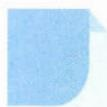

# 34 均值不等式

引路人 浙江省杭州第二中学 杨帆

本思想方法涉及模块: 函数、三角、数列、不等式、解析几何.

![[高中/思维方法/高中数学思想方法导引2023版/34_均值不等式/方法介绍/方法介绍.md]]
![[高中/思维方法/高中数学思想方法导引2023版/34_均值不等式/典例示范/典例示范.md]]
![[高中/思维方法/高中数学思想方法导引2023版/34_均值不等式/巩固练习/巩固练习.md]]
