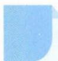

# 35 柯西不等式

## 方法介绍

柯西不等式是数学中一个非常重要的不等式,它历史悠久,形式优美,结构对称,具有较强的应用性.柯西不等式也是高中数学的一个重要知识点,是证明命题、研究最值问题的强有力的工具.它常常作为重要的基础去架设条件与结论间的桥梁,以证明和推广其他不等式,是发现新命题的重要工具,是一个极有魅力的不等式.

柯西不等式: 设 $x_{1}, x_{2}, \cdots, x_{n}, y_{1}, y_{2}, \cdots, y_{n}$ 均是实数，

则 $(x_{1}y_{1}+x_{2}y_{2}+\cdots+x_{n}y_{n})^{2}\leqslant(x_{1}^{2}+x_{2}^{2}+\cdots+x_{n}^{2})(y_{1}^{2}+y_{2}^{2}+\cdots+y_{n}^{2})$

当且仅当 $x_{i}=\lambda y_{i}(i=1,2,\cdots,n)$ 时取等号.

![[高中/思维方法/高中数学思想方法导引2023版/35_柯西不等式/典例示范/典例示范.md]]
![[高中/思维方法/高中数学思想方法导引2023版/35_柯西不等式/巩固练习/巩固练习.md]]
