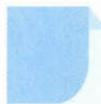

# 36 变角变次

## 方法介绍

所谓变角,即根据问题中的角与已知条件中的角之间的联系,进行角之间的变换.特别要关注两角的和差是否是常见角.

所谓变次,即降次与升次,最常见的就是倍角公式升次与半角公式降次.

通过一系列的“变角”“变次”，利用等价转换，可使复杂问题简单化，陌生问题熟悉化，从而解决三角求值、化简、证明等问题.

![[高中/思维方法/高中数学思想方法导引2023版/36_变角变次/典例示范/典例示范.md]]
![[高中/思维方法/高中数学思想方法导引2023版/36_变角变次/巩固练习/巩固练习.md]]
