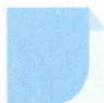

# 39 边角互化

## 方法介绍

边角互化是在解与三角形有关的问题时,处理三角形边、角混合条件的一种常用手段.利用逻辑推理,通过正弦定理或余弦定理进行边角互化,综合利用三角恒等变换等知识推出三角形的边角关系,进而求值(范围)或判断三角形的形状.若要把“边”化为“角”,常利用 $a=2R\sin A$ , $b=2R\sin B$ , $c=2R\sin C$ ;若要把“角”化为“边”,常利用 $\sin A=\frac{a}{2R}$ , $\sin B=\frac{b}{2R}$ , $\sin C=\frac{c}{2R}$ , $\cos C=\frac{a^{2}+b^{2}-c^{2}}{2ab}$ 等.

![[高中/思维方法/高中数学思想方法导引2023版/39_边角互化/典例示范/典例示范.md]]
![[高中/思维方法/高中数学思想方法导引2023版/39_边角互化/巩固练习/巩固练习.md]]
