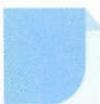

# 40 和差代换

## 方法介绍

对于任意实数 $x, y$ ，均有 $x = \frac{x + y}{2} + \frac{x - y}{2}, y = \frac{x + y}{2} - \frac{x - y}{2}$ ，若令 $\left\{ \begin{array}{l} a = \frac{x + y}{2}, \\ b = \frac{x - y}{2}, \end{array} \right.$ 则有 $\left\{ \begin{array}{l} x = a + b, \\ y = a - b, \end{array} \right.$ 这种代换称作和差代换，它描述了解析几何中坐标旋转的一种形式。比如等轴双曲线 $xy = 1$ ，令 $\left\{ \begin{array}{l} x = a + b, \\ y = a - b, \end{array} \right.$ 则可以转化为标准形式的等轴双曲线 $a^2 - b^2 = 1$ 。实际上，和差代换起到了把坐标轴逆时针旋转 $45^\circ$ 的作用。一般地，当已知条件或所求中出现“和平衡形式” $k(x^n \pm y^n)(n \in \mathbf{N}^*)$ 或“积平衡形式” $x^n y^n (n \in \mathbf{N})$ 时，则令 $\left\{ \begin{array}{l} x = a + b, \\ y = a - b, \end{array} \right.$ 经过和、差、积的运算，可达到减元、消元的目的。

![[高中/思维方法/高中数学思想方法导引2023版/40_和差代换/典例示范/典例示范.md]]
![[高中/思维方法/高中数学思想方法导引2023版/40_和差代换/巩固练习/巩固练习.md]]
