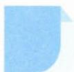

# 41 三角代换

## 方法介绍

所谓三角代换,是指利用三角函数的性质将代数或几何问题转化成三角问题,使题目得以突破的解题方法,其实质是换元思想,体现了“三角”是数学中的工具的特征,恰当地利用三角代换有助于培养学生联想和类比的能力.

当三角代换可应用于去根号或问题变换成三角形式易求解时,应利用已知代数式与三角知识中的某些联系进行换元.例如,求函数 $y=\sqrt{x}+\sqrt{1-x}$ 的值域时,易发现 $x\in[0,1]$ , 设 $x=\sin^{2}\theta,\theta\in\left[0,\frac{\pi}{2}\right]$ , 问题就变成了熟悉的求三角函数值域;当变量 x,y 满足条件 $x^{2}+y^{2}=r^{2}(r>0)$ 时,可进行三角代换 $x=r\cos\theta,y=r\sin\theta$ , 化为三角问题.

![[高中/思维方法/高中数学思想方法导引2023版/41_三角代换/典例示范/典例示范.md]]
![[高中/思维方法/高中数学思想方法导引2023版/41_三角代换/巩固练习/巩固练习.md]]
