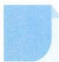

<!-- question-source:start -->
5. 设 $\triangle ABC$ 的三个顶点在椭圆 $\frac{x^2}{a^2} + \frac{y^2}{b^2} = 1 (a > b > 0)$ 上, 坐标原点 $O$ 是 $\triangle ABC$ 的重心, 求证: $\triangle ABC$ 的面积为定值.

<!-- question-source:end -->

![[Q00009832A1]]
