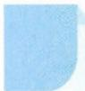

# 43 构造对偶

# 引路人 浙江省金华第一中学 吴贤盛

本思想方法涉及模块:三角、数列、不等式、函数、方程.

![[高中/思维方法/高中数学思想方法导引2023版/43_构造对偶/方法介绍/方法介绍.md]]
![[高中/思维方法/高中数学思想方法导引2023版/43_构造对偶/典例示范/典例示范.md]]
![[高中/思维方法/高中数学思想方法导引2023版/43_构造对偶/巩固练习/巩固练习.md]]
