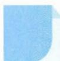

# 44 合一变形

# 引路人 义乌市青岩书院 王鑫

本思想方法涉及模块:三角、函数、不等式、向量.

![[高中/思维方法/高中数学思想方法导引2023版/44_合一变形/方法介绍/方法介绍.md]]
![[高中/思维方法/高中数学思想方法导引2023版/44_合一变形/典例示范/典例示范.md]]
![[高中/思维方法/高中数学思想方法导引2023版/44_合一变形/巩固练习/巩固练习.md]]
