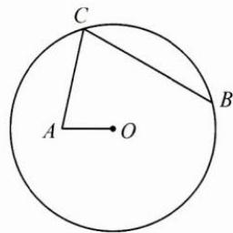

<!-- question-source:start -->
5. 已知 $\triangle ABC$ 的内角 A, B, C 的对边分别为 a, b, c, $(\sin B - \sin C)^{2} = \sin^{2} A - \sin B \sin C.$

(1) 求 A;

(2) 若 $\sqrt{2}a + b = 2c$ ，求 $\sin C.$
<!-- question-source:end -->

![[Q00009845A1]]
