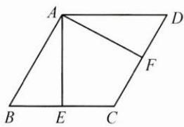
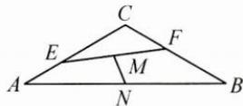

## (一)平面几何背景

例 1 如图, 已知菱形 ABCD 的边长为 2, $\angle BAD = 120^{\circ}$ , 点 E, F 分别在边 BC, CD 上, $\overrightarrow{BE} = \lambda \overrightarrow{BC}, \overrightarrow{DF} = \mu \overrightarrow{DC}$ , 若 $\lambda + \mu = \frac{2}{3}$ , 则 $\overrightarrow{AE} \cdot \overrightarrow{AF}$ 的最小值为 \_\_\_\_.

思路 本题要求两个向量的数量积,故考虑选取合适的基底来表示向量 $\overrightarrow{AE},\overrightarrow{AF}$ ,利用数量积运算求解.

解答 取 $\overrightarrow{AB},\overrightarrow{AD}$ 为一组基底，

因为 $\overrightarrow{BE} = \lambda \overrightarrow{BC} = \lambda \overrightarrow{AD},\overrightarrow{DF} = \mu \overrightarrow{DC} = \mu \overrightarrow{AB}$ 所以 $\overrightarrow{AE}\cdot \overrightarrow{AF} = (\overrightarrow{AB} +\overrightarrow{BE})\cdot (\overrightarrow{AD} +\overrightarrow{DF}) = (\overrightarrow{AB} +\lambda \overrightarrow{AD})\cdot (\overrightarrow{AD} +\mu \overrightarrow{AB})$ $= \lambda \overrightarrow{AD}^2 +\mu \overrightarrow{AB}^2 +(1 + \lambda \mu)\overrightarrow{AB}\cdot \overrightarrow{AD}$ $= 4(\lambda +\mu) + (1 + \lambda \mu)\times 2\times 2\times \left(-\frac{1}{2}\right) = -2(1 + \lambda \mu) + \frac{8}{3}.$ 因为 $\lambda +\mu = \frac{2}{3},\lambda ,\mu >0$ ，所以 $\lambda \mu \leqslant \left(\frac{\lambda + \mu}{2}\right)^2 = \frac{1}{9}$ 所以 $\overrightarrow{AE}\cdot \overrightarrow{AF} = -2(1 + \lambda \mu) + \frac{8}{3}\geqslant \frac{4}{9}$ 当且仅当 $\lambda = \mu = \frac{1}{3}$ 时取等号.故所求最小值为 $\frac{4}{9}$

反思 数量积是两个向量之间的一种运算,它具有良好的运算律.用基向量法解决数量积问题,一般步骤为:①用基底表示所求向量;②遵循向量数量积的运算律,将原本毫无瓜葛的两个向量之间的运算转化为两个已知模长和夹角的基底向量之间的运算.

例2 如图, 在 $\triangle ABC$ 中, $AC=BC=1$ , $AB=\sqrt{3}$ , $\overrightarrow{CE}=x\overrightarrow{CA},\overrightarrow{CF}=y\overrightarrow{CB}$ , 其中 $x,y\in(0,1)$ , 且 $x+4y=1$ , 若 $M,N$ 分别是线段 $EF$ , $AB$ 的中点, 求线段 $MN$ 长度的最小值.

思路 向量的模长对应线段的长度,因此用求向量模长的方式来求平面几何中的长度是很好的方法.

解答 取 $\overrightarrow{CA},\overrightarrow{CB}$ 为一组基底,易知其夹角为 $120^{\circ}$ ,

$$
\overrightarrow {C M} = \frac {1}{2} \overrightarrow {C E} + \frac {1}{2} \overrightarrow {C F} = \frac {x}{2} \overrightarrow {C A} + \frac {y}{2} \overrightarrow {C B}, \overrightarrow {C N} = \frac {1}{2} \overrightarrow {C A} + \frac {1}{2} \overrightarrow {C B},
$$

故 $\overrightarrow{MN} = \overrightarrow{CN} -\overrightarrow{CM} = \left(\frac{1}{2}\overrightarrow{CA} +\frac{1}{2}\overrightarrow{CB}\right) - \left(\frac{x}{2}\overrightarrow{CA} +\frac{y}{2}\overrightarrow{CB}\right) = \left(\frac{1}{2} -\frac{x}{2}\right)\overrightarrow{CA}+$ $(\frac{1}{2} -\frac{y}{2})\overrightarrow{CB},$

$$
| \overrightarrow {M N} | ^ {2} = \left[ \left(\frac {1}{2} - \frac {x}{2}\right) \overrightarrow {C A} + \left(\frac {1}{2} - \frac {y}{2}\right) \overrightarrow {C B} \right] ^ {2}
$$

$$
= \left(\frac {1}{2} - \frac {x}{2}\right) ^ {2} + \left(\frac {1}{2} - \frac {y}{2}\right) ^ {2} - \left(\frac {1}{2} - \frac {x}{2}\right) \left(\frac {1}{2} - \frac {y}{2}\right).
$$

因为 $x+4y=1$ ，故 $x=1-4y\in(0,1)$ ，得 $y\in\left(0,\frac{1}{4}\right)$ ，

即 $|\overrightarrow{MN}|^2 = \frac{1}{4} (21y^2 - 6y + 1), y \in \left(0, \frac{1}{4}\right)$ ,

故当 $y=\frac{1}{7}$ 时，MN 的长度取得最小值 $\frac{\sqrt{7}}{7}$ .

反思 用基向量法解决模长问题,一般步骤为:①用基底表示所求向量;②利用向量模长公式 $|a|=\sqrt{a^{2}}$ ,转化为基底之间的运算.
