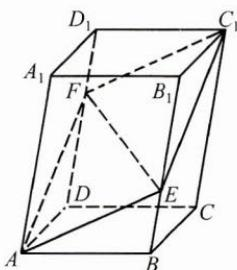
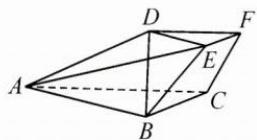

## (二)立体几何背景

基向量法不仅在平面几何问题中广泛使用,用空间向量解决立体几何问题同样有效.大家经常会用向量坐标法解决立体几何问题,它其实是基向量法的一种特殊情况,即选取的一组基底恰为正交基底.所以基向量法是一种更为本质的处理方法.

例3 如图, 在平行六面体 $ABCD-A_{1}B_{1}C_{1}D_{1}$ 中, 已知 $\angle A_{1}AB=\angle A_{1}AD=\angle DAB=\frac{\pi}{3}$ , 其中 AB=2, AD=3, $AA_{1}=4$ , 点 E, F 分别在 $BB_{1}$ 和 $DD_{1}$ 上, 且 $BE=\frac{1}{3}BB_{1}, DF=\frac{2}{3}DD_{1}$ .

(1) 证明: A, E, $C_{1}$ , F 四点共面;

(2) 求 EF 的长度.

思路 本题的模型是一个平行六面体,常规的建系设点需要配合几何推导和辅助证明.选取斜基底可以迅速解决空间中的共面问题和长度问题.

解答 (1) 取 $\overrightarrow{AB}, \overrightarrow{AD}, \overrightarrow{AA_1}$ 为一组基底, 则 $\overrightarrow{AF} = \overrightarrow{AD} + \overrightarrow{DF} = \overrightarrow{AD} + \frac{2}{3} \overrightarrow{AA_1}$ , $\overrightarrow{AE} = \overrightarrow{AB} + \overrightarrow{BE} = \overrightarrow{AB} + \frac{1}{3} \overrightarrow{AA_1}, \overrightarrow{AC_1} = \overrightarrow{AB} + \overrightarrow{AD} + \overrightarrow{AA_1}$ , 于是 $\overrightarrow{AC_1} = \overrightarrow{AF} + \overrightarrow{AE}$ , 故 $A, E, C_1, F$ 四点共面.

$$
\overrightarrow {E F} = \overrightarrow {A F} - \overrightarrow {A E} = \overrightarrow {A D} - \overrightarrow {A B} + \frac {1}{3} \overrightarrow {A A _ {1}}, \tag {2}
$$

$$
\begin{array}{r l} & {\text {则} | \overrightarrow {E F} | = \sqrt {\left(\overrightarrow {A D} - \overrightarrow {A B} + \frac {1}{3} \overrightarrow {A A _ {1}}\right) ^ {2}}} \\ & {= \sqrt {\overrightarrow {A D ^ {2}} + \overrightarrow {A B ^ {2}} + \frac {1}{9} \overrightarrow {A A _ {1}} ^ {2} - 2   \overrightarrow {A D} \cdot \overrightarrow {A B} - \frac {2}{3} \overrightarrow {A B} \cdot \overrightarrow {A A _ {1}} + \frac {2}{3} \overrightarrow {A D} \cdot \overrightarrow {A A _ {1}}}} \\ & {= \frac {\sqrt {9 1}}{3}.} \end{array}
$$

反思 对于立体几何中许多不易建立空间直角坐标系的问题,空间基向量法或许是不错的选择.

例 4 如图, 在三棱台 ABC-DEF 中, 平面 $ACFD \perp$ 平面 ABC, AB = AD = 2DE = 3, $BC = \sqrt{3}$ , $AC = 3\sqrt{2}$ , $CF = \frac{\sqrt{6}}{2}$ .

(1) 证明: $CA \perp BD$ ;

(2)求直线 AE 与平面 ABC 所成角的正弦值.

思路 本题的难点在于不易建立空间直角坐标系,因此选取模长已知的向量 $\overrightarrow{AB},\overrightarrow{AC},\overrightarrow{AD}$ 为基底,从而迅速解决立体几何中的位置关系和求角问题.

解答 (1) 记 $\overrightarrow{AB} = a, \overrightarrow{AC} = b, \overrightarrow{AD} = c$ ，则有 $|a| = 3, |b| = 3\sqrt{2}, |c| = 3$ .

由 $\sqrt{3} = |\overrightarrow{BC}| = |a - b| = \sqrt{9 + 18 - 2a\cdot b}$ ，得 $a\cdot b = 12$

又 $\overrightarrow{CF} = \overrightarrow{CA} +\overrightarrow{AD} +\overrightarrow{DF} = -\frac{1}{2}\pmb {b} + \pmb {c},$

故 $\frac{\sqrt{6}}{2}=|\overrightarrow{CF}|=\sqrt{\frac{9}{2}+9-\boldsymbol{b}\cdot\boldsymbol{c}}$ ，得 $b\cdot c=12$ .

因为 $\overrightarrow{BD}=\overrightarrow{BA}+\overrightarrow{AD}=-a+c,$

所以 $\overrightarrow{AC} \cdot \overrightarrow{BD} = \boldsymbol{b} \cdot (-\boldsymbol{a} + \boldsymbol{c}) = \boldsymbol{b} \cdot \boldsymbol{c} - \boldsymbol{a} \cdot \boldsymbol{b} = 0$ ，故 $CA \perp BD$ .

(2)设平面 ABC 的一个法向量为 n，由平面 $ACFD \perp$ 平面 ABC 可知 $n \parallel$ 平面 ACFD，所以 $n = xb + yc$ .

由 $n \perp a, n \perp b$ ，可得 $n \cdot a = xa \cdot b + ya \cdot c = 12x + ya \cdot c = 0$

$$
\boldsymbol {n} \cdot \boldsymbol {b} = x \boldsymbol {b} ^ {2} + y \boldsymbol {b} \cdot \boldsymbol {c} = 1 8 x + 1 2 y = 0.
$$

取 x=2，则 $y=-3, n=2b-3c, a \cdot c=8, |n|=\sqrt{(2b-3c)^{2}}=3.$

另一方面， $\overrightarrow{AE} = \overrightarrow{AD} +\overrightarrow{DE} = \frac{1}{2}\pmb {a} + \pmb {c}$ ，所以 $|\overrightarrow{AE}| = \left|\frac{1}{2}\pmb {a} + \pmb {c}\right| = \frac{\sqrt{77}}{2}.$ 设直线 $AE$ 与平面ABC所成角为 $\theta$

则 $\sin \theta = \frac{|n\cdot\overrightarrow{AE}|}{|n||\overrightarrow{AE}|} = \frac{|n\cdot(\frac{1}{2}a + c)|}{|n||\frac{1}{2}a + c|} = \frac{n\cdot c}{|n||\frac{1}{2}a + c|} = \frac{(2b - 3c)\cdot c}{|n||\frac{1}{2}a + c|} =$ $\frac{|24 - 27|}{3\times\frac{\sqrt{77}}{2}} = \frac{2\sqrt{77}}{77}.$

反思 基向量法不用添辅助线,用代数的运算来弥补几何的缺失,是沟通代数与几何的一座桥梁.我们常用的空间直角坐标系法其实就是基向量法的一种特殊情况.在第(2)问的解答过程中,涉及用基向量表示平面的法向量,一种方式是结合立体图形的特点,找出平面的法向量并表示之,而另一种方式是完全通过代数运算,算出法向量的基底表示.

