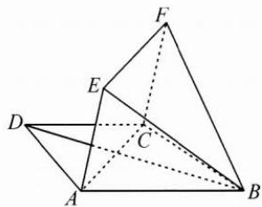

<!-- question-source:start -->
4. 如图, 在梯形 $ABCD$ 中, $AB \parallel CD$ , $AD = CD = BC = 2$ , $\angle ABC = 60^\circ$ ; 在矩形 $ACFE$ 中, $AE = 1$ ; $BF = \sqrt{3}$ .

(1) 求证: $AC \perp BF$ ;

(2)求直线 BD 与平面 BEF 所成角 $\theta$ 的正弦值.
<!-- question-source:end -->

![[Q00009853A1]]
