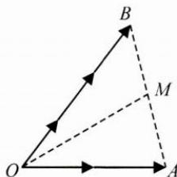
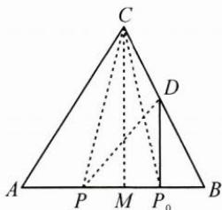

## 典例示范

例1 已知向量 $a, b$ 满足 $|2a + 3b| = 1$ , 则 $a \cdot b$ 的最大值为 \_\_\_\_.

思路 解决本题的关键是如何表达 $a \cdot b$ ，结合模长为定值1的条件，可以考虑构造对称平方，即 $a \cdot b = \frac{(2a + 3b)^2}{24} - \frac{(2a - 3b)^2}{24}$ ，再结合 $(2a - 3b)^2 \geqslant 0$ 得出最大值。如果能够想到极化恒等式是专门用来解决向量数量积问题的，那么 $a \cdot b$ 就会有另一种表达方式了。

解答 如图, 设 $2a=\overrightarrow{OA}, 3b=\overrightarrow{OB}$ ,

取 $AB$ 的中点 $M$ , 则 $|\overrightarrow{OM}| = \frac{1}{2} |2a + 3b| = \frac{1}{2}$ ,

对于 $\triangle OAB$ ，由极化恒等式可知 $2a\cdot 3b = \overrightarrow{OA}\cdot \overrightarrow{OB} =$ $\overrightarrow{OM^2} -\overrightarrow{MB^2}$

$|\overrightarrow{OM}|=\frac{1}{2}$ 是定值，当 $\angle BOA$ 趋向于0时， $|\overrightarrow{MB}|$ 趋向于0，

所以 $2a \cdot 3b = \overrightarrow{OM^2} - \overrightarrow{MB^2} \leqslant \frac{1}{4} - 0 = \frac{1}{4}$ , 因此 $a \cdot b$ 的最大值为 $\frac{1}{24}$ .

反思 本题给出平面向量的线性条件,求解平面向量数量积的最大值,问题设置简洁,但要真正化解运算却要费一番功夫.考虑到向量的几何背景,画出线性图形,构造三角形和一边的中点M,利用极化恒等式,问题就能迎刃而解.

例 2 在 $\triangle ABC$ 中， $P_{0}$ 是边 $AB$ 上的定点，满足 $P_{0}B=\frac{1}{4}AB$ ，且对于边 $AB$ 上任意一点 $P$ ，恒有 $\overrightarrow{PB}\cdot\overrightarrow{PC}\geqslant\overrightarrow{P_{0}B}\cdot\overrightarrow{P_{0}C}$ ，则（）.

A. $\angle ABC=90^{\circ}$ B. $\angle BAC=90^{\circ}$ C. $AB=AC$ D. $AC=BC$

思路 本题若采用普通的方法, 只能通过逐个检验, 对不满足条件的情况进行排除, 从而选出答案, 需要花费较多的时间. 如果注意到这是一个关于向量数量积的问题, 而且是在三角形的模型背景下, 就可以尝试采用极化恒等式进行突破.

解答 如图, 设 D 为 BC 的中点.

由极化恒等式得 $\overrightarrow{PB} \cdot \overrightarrow{PC} = \overrightarrow{PD^2} - \overrightarrow{BD^2}, \overrightarrow{P_0B} \cdot \overrightarrow{P_0C} = \overrightarrow{P_0D^2} - \overrightarrow{BD^2}$ , 由 $\overrightarrow{PB} \cdot \overrightarrow{PC} \geqslant \overrightarrow{P_0B} \cdot \overrightarrow{P_0C}$ , 即 $\overrightarrow{PD^2} \geqslant \overrightarrow{P_0D^2}$ , 得 $|\overrightarrow{PD}| \geqslant |\overrightarrow{P_0D}|$ , 即 $P_0D$ 是点 $D$ 与边 $AB$ 上任意一点 $P$ 连线的最小值, 故 $P_0D \perp AB$ . 作 $CM \perp AB$ , 由于 $D$ 为 $BC$ 的中点, 故 $P_0$ 为 $BM$ 的中点, 而 $P_0B = \frac{1}{4} AB$ , 故 $BM = \frac{1}{2} AB$ , 故 $M$ 为 $AB$ 的中点, 所以 $AC = BC$ . 故选 D.

反思 本题很好地反映了利用极化恒等式处理动点数量积问题的优越性. 将数量积转化为线段长度的关系, 使得“数”的问题更加形象化.

例3 已知 $A, B$ 为双曲线 $\frac{x^2}{16} - \frac{y^2}{4} = 1$ 上经过原点的一条动弦， $M$ 为圆 $C: x^2 + (y - 2)^2 = 1$ 上的一个动点，则 $\overrightarrow{MA} \cdot \overrightarrow{MB}$ 的最大值为（ ）.
A. -15    B. -9    C. -7    D. -6

思路 处理圆锥曲线中的向量关系,一般方法是运用坐标法结合韦达定理进行运算求解,此法运算量大,需要扎实的运算功底.考虑到本题是有关向量数量积的问题,可以采用极化恒等式,更加简洁高效.

解答 O 为 AB 的中点, 由极化恒等式可得 $\overrightarrow{MA} \cdot \overrightarrow{MB} = \overrightarrow{MO^{2}} - \overrightarrow{OA^{2}}$ ,
而 $\overrightarrow{MO_{\max}^{2}}=(2+1)^{2}=9,\overrightarrow{OA}_{\min}^{2}=4^{2}=16$ 因此 $\overrightarrow{MA}\cdot\overrightarrow{MB}$ 的最大值为 $\overrightarrow{MO_{\max}^{2}}-\overrightarrow{OA_{\min}^{2}}=9-16=-7$ ，故选C.

反思 在圆锥曲线中,如果能结合其规律特点运用极化恒等式,那么效果是非常不错的,作为工具的极化恒等式既体现了应用之美,又体现了几何之美.

