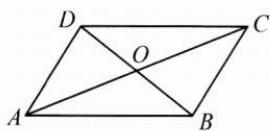

## (二)几何延伸

(1) 平行四边形模型

向量的数量积表示为以这组向量为邻边的平行四边形的“和对角线”与

“差对角线”平方差的 $\frac{1}{4}$ .

如图， $\overrightarrow{AB}\cdot \overrightarrow{AD} = \frac{1}{4}\big(|\overrightarrow{AC}|^2 -|\overrightarrow{DB}|^2\big).$

(2)三角形模型

向量的数量积可表示为三角形中线长与半底边长的平方差.

如图， $O$ 为 $BD$ 的中点， $\overrightarrow{AB} \cdot \overrightarrow{AD} = |\overrightarrow{AO}|^2 - |\overrightarrow{OD}|^2.$

