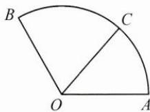
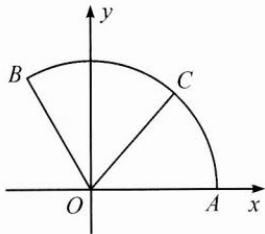
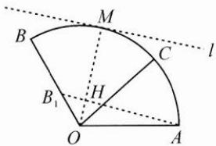

类型一: 利用等高线, 确定两系数的线性表达式 $\lambda x + \mu y$ 的最值.

例1 如图, $\overrightarrow{OA}, \overrightarrow{OB}$ 是夹角为 $\frac{2\pi}{3}$ 的两个单位向量, 点 $C$ 在以 $O$ 为圆心的圆弧 $\widehat{AB}$ 上运动 (含端点). 若 $\overrightarrow{OC} = x\overrightarrow{OA} + y\overrightarrow{OB}$ , 其中 $x, y \in \mathbb{R}$ , 则 $x + 2y$ 的最大值是 \_\_\_\_.

思路 思路一:由于动点 C 的变化使 x, y 变化, 从而选择能描述动点 C 变化的一个变量, 建立 $x + 2y$ 与此变量之间的函数关系, 可以考虑建立直角坐标系, 设 $C(\cos\theta, \sin\theta)$ , 其中 $\theta \in \left[0, \frac{2\pi}{3}\right]$ , 从而转化为平面向量的坐标运算来处理. 思路二: 由 $\overrightarrow{OC} = x \overrightarrow{OA} + y \overrightarrow{OB}$ 的表达形式知, 本题是求两个系数和的最值, 因此可以用等高线的相关结论来处理.

解答 解法1:如图1,以O为坐标原点,建立平面直角坐标系,则A(1,0),B $\left(-\frac{1}{2},\frac{\sqrt{3}}{2}\right)$ ,设C $(\cos\theta,\sin\theta)$ ,其中 $\theta\in\left[0,\frac{2\pi}{3}\right]$ .
由 $\overrightarrow{OC}=x\overrightarrow{OA}+y\overrightarrow{OB}$ ，得 $(\cos\theta,\sin\theta)=x(1,0)+y\left(-\frac{1}{2},\frac{\sqrt{3}}{2}\right)$ ，解得 $\left\{\begin{aligned}x&=\cos\theta+\frac{1}{\sqrt{3}}\sin\theta,\\ y&=\frac{2}{\sqrt{3}}\sin\theta,\end{aligned}\right.$ 所以 $x+2y=\cos\theta+\frac{5}{\sqrt{3}}\sin\theta=\frac{2\sqrt{21}}{3}\sin(\theta+\varphi)\leqslant\frac{2\sqrt{21}}{3}$ （其中 $\tan\varphi=\frac{\sqrt{3}}{5}$ ），
当且仅当 $\theta=\frac{\pi}{2}-\varphi$ 时， $x+2y$ 的最大值为 $\frac{2\sqrt{21}}{3}$ .

图1

图2

解法 2: 设 $B_{1}$ 为 OB 的中点, 则 $\overrightarrow{OC}=x\overrightarrow{OA}+y\overrightarrow{OB}=x\overrightarrow{OA}+2y\left(\frac{1}{2}\overrightarrow{OB}\right)=x\overrightarrow{OA}+2y\left(\overrightarrow{OB}_{1}\right)$ .

连接 $AB_{1}$ ，平移直线 $AB_{1}$ 至与 $\overrightarrow{AB}$ 相切，记为 $l$ ，切点记为 $M$ ，连接 $OM$ ，交 $AB_{1}$ 于点 $H$ ，如图2，则将 $\overrightarrow{OH}$ 用 $\overrightarrow{OA},\overrightarrow{OB_1}$ 线性表示，对应系数和等于1.

利用余弦定理得 $AB_{1}=\frac{\sqrt{7}}{2}$ ，由 $S_{\triangle OAB_{1}}=\frac{1}{2}OA\cdot OB_{1}\cdot\sin\frac{2\pi}{3}=\frac{1}{2}AB_{1}\cdot OH$ ，解得 $OH=\frac{\sqrt{3}}{2\sqrt{7}}$ ，故由等高线的结论知当 $x+2y$ 取得最大值时点 C 与点 M 重合，最大值为 $\frac{OM}{OH}=\frac{2\sqrt{21}}{3}$ .

反思 由 $\overrightarrow{OC} = x\overrightarrow{OA} +y\overrightarrow{OB}$ ，利用等高线求 $\lambda x + \mu y$ 的最值的步骤为：

1. 确定系数和的值为 1 的等高线；

2. 平移(旋转)该等高线，结合动点的可行域，分析在何处取得最大值和最小值；

3. 由长度比(点的位置), 计算最大值和最小值.
