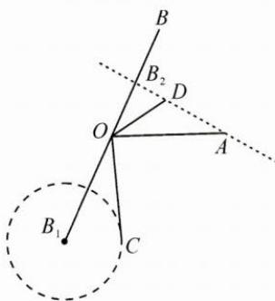

类型二: 利用等高线, 确定终点轨迹.

例2 已知平面非零向量 $a, b, c, d$ ，满足 $|a| = |b| = a \cdot b = 2, |c + b| = 1, d = (1 - 2\lambda)a + \lambda b$ ，则 $|c - d|$ 的最小值为 \_\_\_\_.

思路 将题目中的基本条件向量 a, b 用几何图形表示, 将限制条件向量 c, d 提炼成向量终点的轨迹, 结合图形求出 $\left|c-d\right|$ 的最小值.

解答 由 $|a| = |b| = a \cdot b = 2$ 知 $a, b$ 的夹角为 $\frac{\pi}{3}$ , 作出 $a = \overrightarrow{OA}, b = \overrightarrow{OB}$ , 如图, 由 $|c + b| = |c - (-b)| = 1$ 确定 $c$ 的终点 $C$ 在以 $-b$ 的终点 $B_{1}$ 为圆心, 1 为半径的圆上, $d = (1 - 2\lambda)a + 2\lambda\left(\frac{1}{2}b\right)$ , 故 $d$ 的终点 $D$ 在直线 $AB_{2}$ 上 ( $B_{2}$ 为 $OB$ 的中点), 得 $|c - d|_{\min} = 2$ .

反思 1. 平面向量共线定理表达式中三个向量的起点务必一致, 若不一致, 本着少数服从多数的原则, 优先平移固定的向量;

2. 利用等高线确定终点的轨迹时, 需要变换基底向量, 使得目标代数式的系数和为定值.

