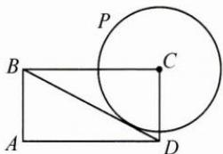

<!-- question-source:start -->
1. 如图，在矩形 ABCD 中，AB=1, AD=2，动点 P 在以点 C 为圆心且与 BD 相切的圆上，若 $\overrightarrow{AP}=\lambda\overrightarrow{AB}+\mu\overrightarrow{AD}$ ，则 $\lambda+\mu$ 的最大值为（）.
A. 3 B. $2\sqrt{2}$ C. $\sqrt{5}$ D. 2

<!-- question-source:end -->

![[Q00009857A1]]
