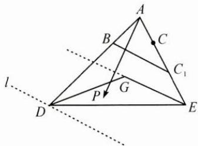

> [!faq]- 巩固练习答案
> **【答案】** $\left[\frac{3}{2},3\right]$
>
> **【解析】**
> $\overrightarrow{AP}=\alpha\overrightarrow{AB}+\frac{1}{2}\beta(2\overrightarrow{AC})=\alpha\overrightarrow{AB}+\frac{1}{2}\beta\overrightarrow{AC_{1}}$ ，如图，易得 $BC_{1}//EG$ 。过点D作 $BC_{1}$ 的平行直线l，当点P在线段EG上时， $\alpha+\frac{1}{2}\beta$ 最小，最小值为 $\frac{3}{2}$ ，当点P与点D重合时， $\alpha+\frac{1}{2}\beta$ 最大，最大值为3。故所求取值范围为 $\left[\frac{3}{2},3\right]$ 。
> 
