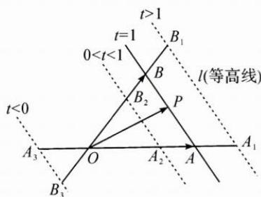

## 方法介绍

若 $\overrightarrow{OA}$ 与 $\overrightarrow{OB}$ 是平面内的任意两个不共线向量，平面内的向量 $\overrightarrow{OP} = x\overrightarrow{OA} + y\overrightarrow{OB}$ ，其中实数 $x, y$ 满足 $x + y = t$ （ $t$ 为定值），则动点 $P$ 的轨迹为与直线 $AB$ 平行的直线 $l$ ，其中 $|t|$ 为相似比。反之亦成立。我们称直线 $l$ 为等高线。

(1) 当等高线恰为直线 AB 时, t=1;

(2) 当等高线在点 O 和直线 AB 之间时, 0 < t < 1;

(3) 当直线 AB 在点 O 和等高线之间时, t > 1;

(4) 当点 O 在直线 AB 和等高线之间时, t<0;

(5) $|t|$ 与等高线到点O的距离成正比.

在平面向量基本定理 $\overrightarrow{OP} = x\overrightarrow{OA} +y\overrightarrow{OB}$ 的表达式中，研究两系数的线性表达式 $\lambda x + \mu y$ 的最值时，可用等高线的相关结论来解决.

