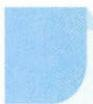

# 49 递推法

# 引路人 浙江省金华市外国语学校 代云龙

本思想方法涉及模块: 函数、数列、计数原理、概率.

![[高中/思维方法/高中数学思想方法导引2023版/49_递推法/方法介绍/方法介绍.md]]
![[高中/思维方法/高中数学思想方法导引2023版/49_递推法/典例示范/典例示范.md]]
![[高中/思维方法/高中数学思想方法导引2023版/49_递推法/巩固练习/巩固练习.md]]
