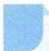

# 50 进退互用

## 方法介绍

所谓进退互用, 就是指利用“化归”解决问题的过程中, 通过“弱化条件”“强化目标”或“弱化目标”等手段解决问题的方法. 当遇到一个非基本的问题时, 可以通过分解、变形、代换、平移、旋转、伸缩等多种方式, 将问题化归为一个熟悉的基本问题. 这是一种进退互用、双向推理的解题方法.

进退互用解题有三个方面:(1)投石问路,以退为进;(2)弱化目标,退中求进;(3)强化目标,以进为退.进与退是相对的,如果问题比较复杂,则退到简单情形,在处理简单情形过程中寻找解决一般情形的途径,体现了由易到难的思想.例如,把立体问题化归为平面问题,体现了以退为进的思想;而构造函数,利用函数的性质解决不等式问题,则体现了以进为退的思想.

![[高中/思维方法/高中数学思想方法导引2023版/50_进退互用/典例示范/典例示范.md]]
![[高中/思维方法/高中数学思想方法导引2023版/50_进退互用/巩固练习/巩固练习.md]]
