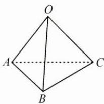

## (二)弱化目标,退中求进

例 2 如图, 在三棱锥 O-ABC 中, OA=BC, OB=AC, OC=AB, 且 $\angle AOB = \alpha, \angle BOC = \beta, \angle COA = \gamma.$ 求证: $\tan\alpha + \tan\beta + \tan\gamma = \tan\alpha\tan\beta\tan\gamma.$

思路 先不急于证明 $\tan\alpha + \tan\beta + \tan\gamma = \tan\alpha\tan\beta\tan\gamma$ ，弱化条件，退一步，考虑证明 $\alpha + \beta + \gamma = \pi$ 。但是 $\alpha, \beta, \gamma$ 为空间中的三个角，不在同一个平面上，能不能利用几何知识，把这三个角放在同一个三角形中呢？

解答 在 $\triangle AOB$ 与 $\triangle BCA$ 中, $AB$ 是公共边, 又 $OA = BC$ , $OB = AC$ , 所以 $\triangle AOB \cong \triangle BCA$ , 所以 $\angle ACB = \alpha$ , 同理可得 $\angle BAC = \beta$ , $\angle ABC = \gamma$ , 从而可得 $\alpha + \beta + \gamma = \pi$ , 所以 $\alpha + \beta = \pi - \gamma$ .

故 $\tan (\alpha +\beta) = \tan (\pi -\gamma)$ ，从而 $\frac{\tan\alpha + \tan\beta}{1 - \tan\alpha\tan\beta} = -\tan \gamma ,$

所以 $\tan\alpha+\tan\beta=-\tan\gamma+\tan\alpha\tan\beta\tan\gamma,$

即 $\tan \alpha +\tan \beta +\tan \gamma = \tan \alpha \tan \beta \tan \gamma .$

反思 从总目标退回来,找到子目标,这是一种逆向推理的思想;再从已知条件出发,达到子目标,实现双向推理.在解题时,要思考:由条件可以得到什么?目标需要做什么?回答这两个问题,往往能快速找到答案.
