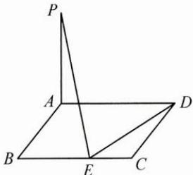

<!-- question-source:start -->
2. 如图, 已知矩形 $ABCD, PA \perp$ 平面 $ABCD, PA = AB = 2, BC = a$ , 若线段 $BC$ 上存在点 $E$ , 使得 $PE \perp DE$ , 则 $a$ 的取值范围为 \_\_\_\_.

<!-- question-source:end -->

![[Q00009867A1]]
