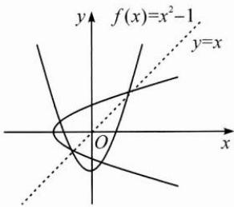

## (一)不动点在函数中的应用

例 1 设集合 $M=\{x\in\mathbf{R}\mid f(x)=x\}$ ， $N=\{x\in\mathbf{R}\mid f(f(x))=x\}$ .

(1) 若 $f(x)=x^{2}-1$ ，求集合 M 和 N；

(2) 求证: $M \subseteq N$ ;

(3) 若 $f(x)=x^{2}-2x+c$ ，且 M=N，求实数 c 的取值范围.

思路 第(1)问,集合M和N即函数的不动点与稳定点.

一般地，设函数 $f(x)$ 的定义域为 $I$ ，如果存在 $x_0\in I$ ，使得 $f(f(x_0)) = x_0$

则称 $x_0$ 为函数 $f(x)$ 的稳定点.

第(2)问是探究不动点与稳定点的关系,第(3)问解决含参数的函数问题.
解答 (1) 因为函数 $f(x)=x^{2}-1$ ，由 $f(x)=x$ ，可得方程 $x^{2}-1=x$ ，
解得 $x=\frac{1\pm\sqrt{5}}{2}$ ，所以 $M=\left\{\frac{1-\sqrt{5}}{2},\frac{1+\sqrt{5}}{2}\right\}$ ;
又由 $f(f(x))=x$ ，得方程 $(x^{2}-1)^{2}-1=x$ ，解得 x=0 或 -1 或 $\frac{1\pm\sqrt{5}}{2}$ ，
所以 $N=\left\{0,-1,\frac{1-\sqrt{5}}{2},\frac{1+\sqrt{5}}{2}\right\}$ .

(2)对于任意 $x \in M$ ，满足 $f(x) = x$ ，可得 $f(f(x)) = f(x) = x$ ，即 $x \in N$ ，所以 $M \subseteq N$ .

(3) 记 $y = f(x)$ ，则关于 x 的方程 $f(f(x)) = x$ 的解为方程组 $\left\{\begin{aligned} y &= x^{2} - 2x + c, \\ x &= y^{2} - 2y + c \end{aligned}\right.$ 的解中 x 的值，两式相减可得 $(x - y)(x + y - 1) = 0$ ①，

$$
x - y = 0
$$

$$
x ^ {2} - x + c - 1 = 0
$$

$\Delta=(-1)^{2}-4(c-1)<0$ , 解得 $c>\frac{5}{4}$ ;

或其解为 $x = y = \frac{1}{2}$ ，解得 $c = \frac{5}{4}$

所以实数 c 的取值范围是 $\left[\frac{5}{4}, +\infty\right)$ .

反思 本题考查了函数与方程的思想. 第(2)问也可以从图象角度来理解, 不动点是函数 $y = f(x)$ 的图象与直线 $y = x$ 的交点的横坐标, 而稳定点则是曲线 $y = f(x)$ 与曲线 $x = f(y)$ 的交点的横坐标. 如图, 若 $x_0$ 为函数 $y = f(x)$ 的不动点, 则 $x_0$ 必为函数 $y = f(x)$ 的稳定点.

<!-- source-part:2 pages:201-330 -->
