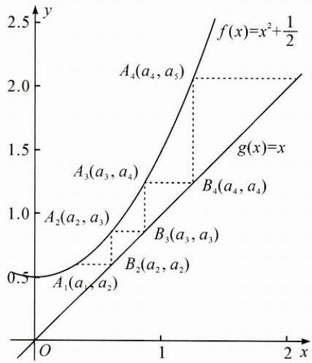
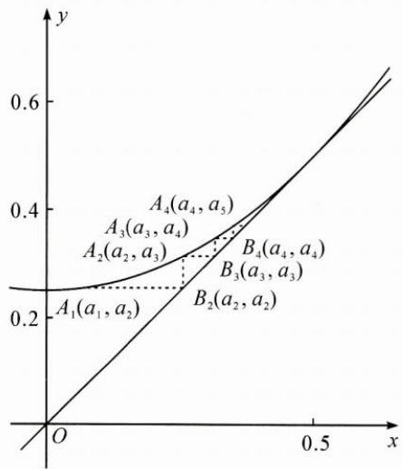

## (二)不动点在数列中的应用

例2 设 $a, b \in \mathbb{R}$ , 数列 $\{a_n\}$ 满足 $a_1 = a, a_{n+1} = a_n^2 + b, n \in \mathbf{N}^*$ , 则（ ）.

A. 当 $b = \frac{1}{2}$ 时, $a_{10} > 10$ B. 当 $b = \frac{1}{4}$ 时, $a_{10} > 10$ C. 当 $b = -2$ 时, $a_{10} > 10$ D. 当 $b = -4$ 时, $a_{10} > 10$

思路 本题四个选项如果一一代入运算,则非常复杂,而如果利用不动点,数形结合,则可大大提升解题速度.

解答 对于 A, 根据 $a_{n+1}=a_{n}^{2}+\frac{1}{2}$ ，作出函数 $f(x)=x^{2}+\frac{1}{2}$ 与 $g(x)=x$ 的图象，此时两图象没有交点，可绘制出迭代图象，如图 1，得出 $a_{n}\rightarrow+\infty$ .

图1

图2

同理,对于 B, 可得函数 $f(x)=x^{2}+\frac{1}{4}$ 有唯一不动点 $\frac{1}{2}$ , 如图 2, 所以 $a_{n}\rightarrow\frac{1}{2}$ .
对于 C, 函数 $f(x)=x^{2}-2$ 有两个不动点 -1 与 2.

当 $a_1 = -1$ 或2时， $a_n$ 分别恒等于-1或2；

当 $a_1 \in [-2, 2)$ 且 $a_1 \neq -1$ 时， $a_n \in [-2, 2]$ ;

当 $a_1 \in (-\infty, -2) \cup (2, +\infty)$ 时， $a_n \to +\infty$

对于 D, 类比 C 可判断.

所以可以排除 B, C, D, 故选 A.

反思 数列是特殊的函数,本题将数列的性质问题转化为函数不动点问题,考查直观想象能力.利用不动点,可以解决一类数列单调性与收敛性的问题.

变式 数列 $\{a_{n}\}$ 中， $a_{1} = 2, a_{n+1} = \frac{5a_{n} + 4}{2a_{n} + 7}$ ，求 $a_{n}$ .

思路 用不动点法求形如 $a_{n + 1} = \frac{pa_n + q}{ta_n + s}$ 的数列通项问题的步骤：

将 $a_{n + 1}, a_n$ 均换成 $x$ , 得 $x = \frac{px + q}{tx + s}$ , 设 $x_1, x_2$ 是函数 $f(x) = \frac{px + q}{tx + s}$ 的两个不动点.

① 若 $f(x)$ 有两个相异的不动点，则可构造出等比型数列 $\left\{\frac{a_n - x_1}{a_n - x_2}\right\}$

② 若 $f(x)$ 有两个相同的不动点，则可构造出等差型数列 $\left\{\frac{1}{a_{n+1} - x_1}\right\}$ .

解答 令 $x = \frac{5x + 4}{2x + 7}$ , 则 $2x^{2} + 7x = 5x + 4$ , 解得 $x_{1} = -2, x_{2} = 1$ .

构造 $\frac{a_{n + 1} + 2}{a_{n + 1} - 1} = 3\cdot \frac{a_n + 2}{a_n - 1}$ ，得 $\frac{a_n + 2}{a_n - 1} = \frac{2 + 2}{2 - 1}\cdot 3^{n - 1} = 4\cdot 3^{n - 1},$

所以 $a_{n} + 2 = 4\cdot 3^{n - 1}a_{n} - 4\cdot 3^{n - 1}$ ，即 $a_{n} = \frac{4\cdot 3^{n - 1} + 2}{4\cdot 3^{n - 1} - 1}$

反思 如果数列对应的函数有两个相同的不动点,比如数列 $\{a_{n}\}$ 满足 $a_{1}=a,a_{n+1}=\frac{1}{2-a_{n}}$ ,求通项 $a_{n}$ ,则令 $x=\frac{1}{2-x}$ ,解得x=1.

①当 a=1 时， $a_{n}=1$ ;

②当 $a \neq 1$ 时， $\frac{1}{a_{n+1} - 1} = \frac{1}{a_n - 1} - 1$ ，得 $a_n = \frac{(1 - a)n + 2a - 1}{(1 - a)n + a}$ .

例3 若数列 $\{x_{n}\}$ 满足 $x_{1} = 1, x_{n} = x_{n + 1} + \ln (1 + x_{n + 1})(n\in \mathbf{N}^{*})$ ，证明：

(1) $0 < x_{n + 1} < x_n$ ;

(2) $2x_{n+1}-x_{n}\leqslant\frac{x_{n}x_{n+1}}{2};$

(3) $\frac{1}{2^{n-1}}\leqslant x_{n}\leqslant\frac{1}{2^{n-2}}.$

思路 由于 $x_{n} - x_{n + 1} = \ln (1 + x_{n + 1})$ ，故第(1)问的关键是证明 $x_{n + 1} > 0$ 而递推关系是 $x_{n} = f(x_{n + 1})$ ，只能由后向前推，故本问采用反证法较合理.要证第(2)问，只需证 $x_{n}x_{n + 1} - 4x_{n + 1} + 2x_{n} = x_{n + 1}^{2} - 2x_{n + 1} + (x_{n + 1} + 2)\ln (1+$ $x_{n + 1})\geqslant 0.$ 于是构造函数 $f(x) = x^{2} - 2x + (x + 2)\ln (1 + x),x\geqslant 0,$ 求导得其在 $(0, + \infty)$ 上单调递增，从而 $f(x)\geqslant f(0) = 0$ ，即得证.下面着重解答第(3)问

解答 (3) 易证不等式 $\ln x \leqslant x - 1$ ，所以 $x_{n} = x_{n+1} + \ln(1 + x_{n+1}) \leqslant x_{n+1} + x_{n+1} = 2x_{n+1}$ ，所以 $x_{n} \geqslant \frac{1}{2^{n-1}}$ 成立.

由(2)知 $\frac{x_n x_{n+1}}{2} \geqslant 2x_{n+1} - x_n$ ，将其看成等式，则可利用不动点法得其不动点为0与2，得 $\frac{x_{n+1} - 2}{x_{n+1} - 0} \leqslant 2 \cdot \frac{x_n - 2}{x_n}$ ，于是 $\frac{1}{x_{n+1}} - \frac{1}{2} \geqslant 2\left(\frac{1}{x_n} - \frac{1}{2}\right) > 0$ ，

所以 $\frac{1}{x_n} -\frac{1}{2}\geqslant 2\left(\frac{1}{x_{n - 1}} -\frac{1}{2}\right)\geqslant \dots \geqslant 2^{n - 1}\left(\frac{1}{x_1} -\frac{1}{2}\right) = 2^{n - 2},$

得 $\frac{1}{x_n} \geqslant \frac{1}{2} + 2^{n-2}$ , 所以 $x_n \leqslant \frac{1}{2^{n-2}}$ .

综上， $\frac{1}{2^{n - 1}}\leqslant x_n\leqslant \frac{1}{2^{n - 2}}.$

反思 第(3)问右边的证明源于递推关系 $x_{n} = \frac{4x_{n + 1}}{x_{n + 1} + 2}$ , 但这样的设置过于常规, 利用不动点法或两边取倒数法均可解决, 因此命题者引入了不等关系, 实现难度的提升.

