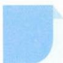

# 52 倒序相加法

引路人 浙江省新昌中学 赵洋

本思想方法涉及模块: 函数、数列、排列组合.

![[高中/思维方法/高中数学思想方法导引2023版/52_倒序相加法/方法介绍/方法介绍.md]]
![[高中/思维方法/高中数学思想方法导引2023版/52_倒序相加法/典例示范/典例示范.md]]
![[高中/思维方法/高中数学思想方法导引2023版/52_倒序相加法/巩固练习/巩固练习.md]]
