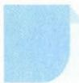

# 53 同除一式

## 方法介绍

同除一式,是指通过对等式的左右两边或对分式的分子、分母同除以一个非零数(或式)的操作,可达到简化代数式结构、消元等目的,最终将原问题转化为更简便易求解的新问题.

![[高中/思维方法/高中数学思想方法导引2023版/53_同除一式/典例示范/典例示范.md]]
![[高中/思维方法/高中数学思想方法导引2023版/53_同除一式/巩固练习/巩固练习.md]]
