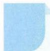

# 55 两边取对数

## 引路人 浙江省杭州高级中学 叶根福

本思想方法涉及模块: 函数.

![[高中/思维方法/高中数学思想方法导引2023版/55_两边取对数/方法介绍/方法介绍.md]]
![[高中/思维方法/高中数学思想方法导引2023版/55_两边取对数/典例示范/典例示范.md]]
![[高中/思维方法/高中数学思想方法导引2023版/55_两边取对数/巩固练习/巩固练习.md]]
