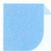

# 60 数学归纳法

# 引路人 杭州市余杭中学 胡艺

本思想方法涉及模块:推理、证明、几何、等式、不等式等.

![[高中/思维方法/高中数学思想方法导引2023版/60_数学归纳法/方法介绍/方法介绍.md]]
![[高中/思维方法/高中数学思想方法导引2023版/60_数学归纳法/典例示范/典例示范.md]]
![[高中/思维方法/高中数学思想方法导引2023版/60_数学归纳法/巩固练习/巩固练习.md]]
