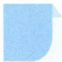
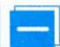

# 62 解析法

## 方法介绍

所谓解析法,是指应用解析式求解数学模型的方法.

在几何问题中,我们常可以应用解析法,通过建立平面直角坐标系,将几何问题转化为代数问题,再通过代数运算解决问题,起到事半功倍的效果.

运用解析法解题有四个步骤:(1)选择恰当的坐标系;(2)用坐标表示数学对象;(3)利用代数运算研究数学对象;(4)将运算结果翻译为几何结论.

![[高中/思维方法/高中数学思想方法导引2023版/62_解析法/典例示范/典例示范.md]]
![[高中/思维方法/高中数学思想方法导引2023版/62_解析法/巩固练习/巩固练习.md]]
