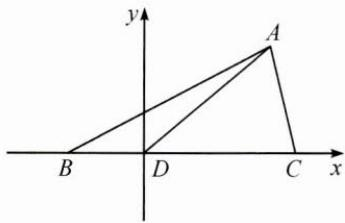

## (一)解析法在平面几何中的应用

例 1 已知在△ABC 中, 点 D 在边 BC 上, ∠ADB=120°, AD=2, CD =2BD, 当 $\frac{AC}{AB}$ 取得最小值时, BD= \_\_\_\_.

思路 首先根据题意选择恰当的平面直角坐标系,即以点 D 为坐标原点建系;再根据 CD=2BD, $\angle ADB=120^{\circ}$ ,表示出点 A,B,C 的坐标;最后利用两点间距离公式得到 $\frac{AC}{AB}$ 的代数表示,并利用基本不等式或函数的单调性求最值.

解答 令 $BD = t(t > 0)$ ，以 $D$ 为原点， $DC$ 为 $x$ 轴，建立如图所示的平面直角坐标系，则 $A(1, \sqrt{3})$ ， $B(-t, 0)$ ， $C(2t, 0)$ 。利用两点间距离公式得 $\frac{AC^2}{AB^2} = \frac{(2t - 1)^2 + 3}{(t + 1)^2 + 3}$ ，化简得 $\frac{AC^2}{AB^2} = \frac{4t^2 - 4t + 4}{t^2 + 2t + 4} = 4 - \frac{12}{(t + 1) + \frac{3}{t + 1}}$ 当且仅当 $t = \sqrt{3} - 1$ 时， $\frac{AC^2}{AB^2}$ 有最小值 $4 - 2\sqrt{3}$ ，

$$
B D = \sqrt {3} - 1
$$

反思 在利用解析法解决平面几何问题时,需要注意以下几个细节.

(1) 恰当地建系可以将数学对象(点、直线等)更方便地用坐标表示. 建系时应充分考虑几何图形的对称性, 同时让尽可能多的相关点在坐标轴上.

(2)准确运用公式来表示几何关系. 常见的有斜率公式、两点间距离公式、点到直线的距离公式等.

(3)充分考虑所设参数的实际意义,并注意其对结果的影响.例如本题中BD为线段,因此需在t>0的前提下进行求解.

例 2 古希腊数学家阿波罗尼斯(约公元前 262—前 190 年)证明过这样一个命题:在平面内到两定点距离之比为常数为 $k(k>0 \text{ 且 } k\neq1)$ 的点的轨迹是圆.后来人们将这个圆称为阿波罗尼斯圆,简称阿氏圆.若平面内两定点 A,B 间的距离为 2,动点 P 满足 $\frac{PA}{PB}=\sqrt{3}$ ,则 $\triangle ABP$ 面积的最大值为 \_\_\_\_.

思路 根据题意,以线段 AB 的中点为坐标原点 O, 建立平面直角坐标系. 设出点 P 的坐标, 根据 $\frac{PA}{PB} = \sqrt{3}$ 列出方程, 化简并确定点 P 的轨迹为圆, 最后由 $S_{\triangle ABP} = \frac{1}{2} |AB| |y|$ 求解最值.

解答 以 AB 的中点为坐标原点 O, AB 方向为 x 轴正方向建立平面直角坐标系, 则 A(-1,0), B(1,0).

设动点 $P(x,y)$ ，因为 $\frac{PA}{PB} = \sqrt{3}$ ，所以有 $\frac{\sqrt{(x + 1)^2 + y^2}}{\sqrt{(x - 1)^2 + y^2}} = \sqrt{3}$

两边平方并整理得 $x^{2}+y^{2}-4x+1=0$ ，

即点 P 的轨迹方程为 $(x-2)^{2}+y^{2}=3$ .

要使 $\triangle ABP$ 的面积最大，只需点 $P$ 的纵坐标 $y$ 取到最大值 $\sqrt{3}$ ，此时 $S_{\triangle ABP}$ 的最大值为 $\frac{1}{2} \times 2 \times \sqrt{3} = \sqrt{3}$ .

反思 在解决平面几何中的动点轨迹问题时常使用解析法,通常先设出动点的坐标,再根据几何条件得到动点的轨迹方程,其中常见的有直线、圆、椭圆等,最后结合圆锥曲线、函数、不等式等知识进行求解.
