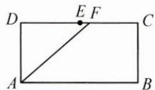
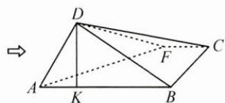
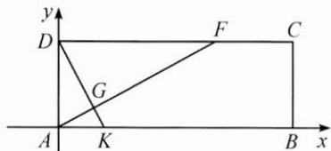

## （二）解析法在立体几何中的应用

例 3 如图, 已知矩形 ABCD, AB = 3, AD = 1, E 为 CD 的中点, F 为线段 CE (除端点外) 上的动点, 将 $\triangle AFD$ 沿 AF 折起, 使平面 $ABD \perp$ 平面 ABC, 在平面 ABD 内, 过点 D 作 $DK \perp AB$ , K 为垂足, 则 AK 长度的取值范围为().

A. $\left(\frac{1}{3},\frac{2}{3}\right)$ B. $\left(\frac{1}{3},\frac{1}{2}\right)$ C. $\left(\frac{1}{3},1\right)$ D. $(0,\frac{1}{2})$

思路 本题可先将立体几何问题转化为平面几何问题,由于原平面图形是矩形,因此可利用解析法建立平面直角坐标系,用坐标表示点 K,进而根据几何条件求得 AK 长度的范围.

解答 在立体图形中, 过点 K 作 $KG \perp AF$ 于点 G, 连接 DG, 因为 $DK \perp AB$ , 平面 $ABD \perp$ 平面 ABC, 所以 $DK \perp$ 平面 ABC, 又 $KG \perp AF$ , 所以 $DG \perp AF$ .

将图形再展开成平面, 在矩形 ABCD 中, 易知 D, G, K 三点共线, 且 $DK \perp AF$ . 以矩形 ABCD 的顶点 A 为坐标原点, $\overrightarrow{AB}$ 方向为 x 轴正方向建立如图所示的平面直角坐标系.

易知 $D(0,1)$ ，设 $K(t,0)$ ，则直线 DK 的方程为 $\frac{x}{t} + y = 1$ .

又 $DK \perp AF$ ，则直线 $AF$ 的方程为 $y = tx$ ，令 $y = 1$ ，得 $x = \frac{1}{t}$ ，即 $DF = \frac{1}{t}$ 。由题意可知 $\frac{3}{2} < \frac{1}{t} < 3$ ，解得 $\frac{1}{3} < t < \frac{2}{3}$ ，故选 A.

反思 本题为立体几何中常见的翻折问题,在利用解析法解决立体几何问题时,若能够化“立体”为“平面”,就能“柳暗花明又一村”.本题也可用特值法或建立空间直角坐标系用空间向量法解决,相比较而言,解析法既可避免特值法的不够严谨,又可以简化空间向量法的繁杂运算.

