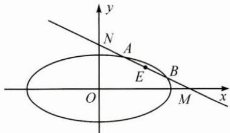

## (一)中点弦问题

例 1 过椭圆 $\frac{x^{2}}{16} + \frac{y^{2}}{4} = 1$ 内一点 $M(2,1)$ 引一条弦，使弦被点 M 平分，求这条弦所在的直线方程.

思路 设弦的两个端点,设而不求,代入椭圆方程,利用平方差公式,整理得到关于弦的斜率与弦中点坐标的关系式,即点差法.

解答 设直线与椭圆的交点为 $A(x_{1},y_{1}),B(x_{2},y_{2})$ ，因为 $M(2,1)$ 为 $AB$ 的中点，所以 $x_{1} + x_{2} = 4,y_{1} + y_{2} = 2,$

又 A, B 两点在椭圆上，则 $x_{1}^{2} + 4y_{1}^{2} = 16$ , $x_{2}^{2} + 4y_{2}^{2} = 16$ ,

两式相减得 $(x_{1}^{2}-x_{2}^{2})+4(y_{1}^{2}-y_{2}^{2})=0$ ，

所以 $\frac{y_{1}-y_{2}}{x_{1}-x_{2}}=-\frac{x_{1}+x_{2}}{4(y_{1}+y_{2})}=-\frac{1}{2}$ ，即 $k_{AB}=-\frac{1}{2}$

故所求直线方程为 $x+2y-4=0$ .

反思 涉及中点弦的问题,当直线与圆锥曲线相交时,可以利用点差法求得中点弦所在直线方程的斜率和中点与原点连线的斜率之间的关系.当然也可以采用通法,即联立方程,看判别式,应用韦达定理,同时也要注意一些细节,如“相交于两点”要转化为“判别式大于零”.

例 2 已知椭圆 $\frac{x^{2}}{6}+\frac{y^{2}}{3}=1$ ，直线 l 与椭圆在第一象限交于 A, B 两点，与 x 轴，y 轴分别交于 M, N 两点，且 $\left|MA\right|=\left|NB\right|,\left|MN\right|=2\sqrt{3}$ ，则直线 l 的方程为 \_\_\_\_.

思路 令 $AB$ 的中点为 $E$ , 设 $A(x_{1}, y_{1}), B(x_{2}, y_{2})$ , 利用点差法得到 $k_{OE} \cdot k_{AB} = -\frac{1}{2}$ , 设直线 $AB: y = kx + m, k < 0, m > 0$ , 求出点 $M, N$ 的坐标, 再根据 $|MN|$ 求出 $k, m$ , 即可得解.

解答 如图，令 $AB$ 的中点为 $E$ ，因为 $|MA| = |NB|$ ，所以 $|ME| = |NE|$

设 $A(x_{1},y_{1}), B(x_{2},y_{2})$ ，由 $\frac{x_{1}^{2}}{6} + \frac{y_{1}^{2}}{3} = 1, \frac{x_{2}^{2}}{6} + \frac{y_{2}^{2}}{3} = 1$ ，

有 $\frac{x_{1}^{2}}{6}-\frac{x_{2}^{2}}{6}+\frac{y_{1}^{2}}{3}-\frac{y_{2}^{2}}{3}=0$ ，即 $\frac{(x_{1}-x_{2})(x_{1}+x_{2})}{6}+\frac{(y_{1}+y_{2})(y_{1}-y_{2})}{3}=0$ ，

所以 $\frac{(y_1 + y_2)(y_1 - y_2)}{(x_1 - x_2)(x_1 + x_2)} = -\frac{1}{2}$ ，即 $k_{OE} \cdot k_{AB} = -\frac{1}{2}$ .

设直线 $AB:y = kx + m,k <   0,m > 0$

令 $x = 0$ 得 $y = m$ ，令 $y = 0$ 得 $x = -\frac{m}{k}$ 即 $M\left(-\frac{m}{k},0\right),N(0,m)$

所以 $E\left(-\frac{m}{2k},\frac{m}{2}\right)$ ，即 $k\cdot\frac{\frac{m}{2}}{-\frac{m}{2k}}=-\frac{1}{2}$ ，解得 $k=-\frac{\sqrt{2}}{2}$ 或 $k=\frac{\sqrt{2}}{2}$ （舍去），又 $\left|MN\right|=\sqrt{m^{2}+(\sqrt{2}m)^{2}}=2\sqrt{3}$ ，解得 m=2 或 m=-2（舍去），所以直线 AB: $y=-\frac{\sqrt{2}}{2}x+2$ ，即 $x+\sqrt{2}y-2\sqrt{2}=0$ 。

反思 条件中虽然没有直接给出弦中点,但是可以通过条件挖掘出弦中点信息,进而利用点差法,结合弦长公式,得到直线方程.
