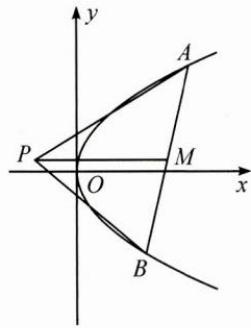

## (二)设而不求,优化解题

例 2 如图, 已知点 P 是 y 轴左侧 (不含 y 轴) 一点, 抛物线 C: $y^{2} = 4x$ 上存在不同的两点 A, B, 满足 PA, PB 的中点均在 C 上. 设 AB 的中点为 M, 证明: $PM \perp y$ 轴.

思路 先用中点坐标公式分别表示出 PA, PB 的中点坐标, 然后结合中点在曲线上将两中点坐标分别代入曲

线方程得到两个同构式,用设而不求思想得到 A,B 两点纵坐标所满足的一元二次方程,结合韦达定理来证明.

解答 设 $A(x_{1},y_{1}),B(x_{2},y_{2}),P(x_{0},y_{0})$

由 $PA, PB$ 的中点都在抛物线上，可得：

$$
\left(\frac {y _ {1} + y _ {0}}{2}\right) ^ {2} = 4 \times \frac {x _ {1} + x _ {0}}{2} \quad ①,
$$

$$
\left(\frac {y _ {2} + y _ {0}}{2}\right) ^ {2} = 4 \times \frac {x _ {2} + x _ {0}}{2} \quad ②,
$$

从而得 $y_{1}, y_{2}$ 是方程 $\left(\frac{y + y_0}{2}\right)^2 = 4 \times \frac{x + x_0}{2}$ 的两个根，

整理方程可得 $y^{2}-2y_{0}y+8x_{0}-y_{0}^{2}=0$ .

结合韦达定理可得 $y_{1} + y_{2} = 2y_{0}$ ，即 $y_{0} = \frac{y_{1} + y_{2}}{2}$ ，

因此 $PM \parallel x$ 轴，即 $PM \perp y$ 轴.

反思 将证明“ $PM \perp y$ 轴”转化为证明“ $y_0 = \frac{y_1 + y_2}{2}$ ”. 解析几何中常常会采用设而不求的方法来处理点坐标间的相互关系, 借助韦达定理巧妙地解决问题.
