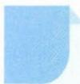

# 65 参数法

## 方法介绍

当直接寻找变量 x, y 间的关系显得困难时, 如能恰当地引入一个新的变量 t (称其为参数), 建立起变量 x, y 与参数 t 的直接关系, 就能间接地建立起 x 和 y 的关系, 这种数学思想就是参数思想, 这种引入参数、建立参数方程求解数学问题的方法, 就称为参数法.

参数法在解析几何中有着广泛的应用,例如用参数法求轨迹、最值以及定点定值问题.使用参数法的一般步骤是:(1)选取恰当的参数 t;(2)建立 x,y 关于参数 t 的参数方程 $\left\{\begin{aligned}x=f(t),\\ y=g(t);\end{aligned}\right.$ (3)通过运算消去参数 t,得到未知量 x,y 的关系,从而获解.在这个过程中,要注意参数 t 的取值范围.

![[高中/思维方法/高中数学思想方法导引2023版/65_参数法/典例示范/典例示范.md]]
![[高中/思维方法/高中数学思想方法导引2023版/65_参数法/巩固练习/巩固练习.md]]
