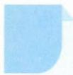

# 66 插空法

## 方法介绍

插空法,是指解决某些元素“不相邻”的排列组合问题的一种思想方法. “不相邻”问题分一种元素不相邻和多种元素同时不相邻两类. 若只有一种元素不相邻,则可先排不受限的元素,再将要求不相邻的元素插入已排好元素的间隙或两端位置. 若有两种或两种以上元素不相邻,则要进行二次插空或多次插空;或先确定插空的模型,如“ABAB”型、“ABABA”型、“ABCBA”型等,再按照模型的结构将相应的元素排入指定位置.

运用插空法解决问题时,不仅要判断相关元素是否相同及其个数,还要根据条件确定可以插空的位置的特征及其个数.若不相同的元素进行插空,则因元素间的有序性而属于排列问题;若相同的元素进行插空,则因元素间的无序性而属于组合问题.解决复杂的不相邻问题时,往往需要将插空法与间接法、分类讨论法等综合起来运用.

![[高中/思维方法/高中数学思想方法导引2023版/66_插空法/典例示范/典例示范.md]]
![[高中/思维方法/高中数学思想方法导引2023版/66_插空法/巩固练习/巩固练习.md]]
