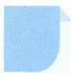

# 68 隔板法

# 引路人 浙江省龙泉市第一中学 蒋吉林

本思想方法涉及模块:排列组合、模型思想.

![[高中/思维方法/高中数学思想方法导引2023版/68_隔板法/方法介绍/方法介绍.md]]
![[高中/思维方法/高中数学思想方法导引2023版/68_隔板法/典例示范/典例示范.md]]
![[高中/思维方法/高中数学思想方法导引2023版/68_隔板法/巩固练习/巩固练习.md]]
