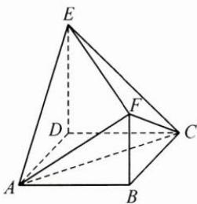
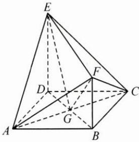
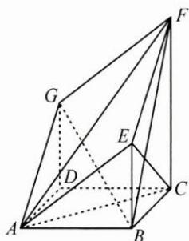
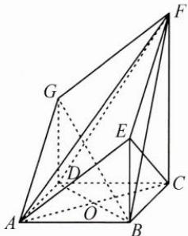

## 典例示范

例1（多选）如图，四边形ABCD为正方形，ED⊥平面ABCD, $FB \parallel ED$ , $AB = ED = 2FB$ ，记三棱锥 $E-$ ACD, $F - ABC$ , $F - ACE$ 的体积分别为 $V_{1}, V_{2}, V_{3}$ 则（ ）.A. $V_{3} = 2V_{2}$ B. $V_{3} = 2V_{1}$ C. $V_{3} = V_{1} + V_{2}$ D. $2V_{3} = 3V_{1}$

思路 本题有两个基本思路:一是利用体积公式找到等量关系和不等关系,通过不等关系破题;二是用特殊值求体积大小破题.

解答 解法 1: 如图, 连接 BD, 交 AC 于点 G, 连接 EG, FG.

$$
V _ {1} = \frac {1}{3} S _ {\triangle A C D} \cdot E D, V _ {2} = \frac {1}{3} S _ {\triangle A B C} \cdot F B,
$$

由于 $S_{\triangle ACD}=S_{\triangle ABC},ED=2FB,$ 故 $V_{1}=2V_{2}.$

因为 $ED \perp$ 平面 ABCD, $AC \subset$ 平面 ABCD,

所以 $AC \perp ED$ ，

又在正方形 ABCD 中， $AC \perp BD$ ，且 $BD \cap ED = D$ ，

所以 $AC \perp$ 平面 BFED，

所以点 E 到平面 FAC 的距离 $h_{E}$ 即为点 E 到 GF 的距离，同理，点 B 到平面 FAC 的距离 $h_{B}$ 为点 B 到 GF 的距离.

因为 $V_{2} = \frac{1}{2} S_{\triangle FAC}\cdot h_{B},V_{3} = \frac{1}{2} S_{\triangle FAC}\cdot h_E$ ，所以判断 $V_{2}$ 与 $V_{3}$ 的倍数关系即判断 $h_B$ 与 $h_E$ 的倍数关系.

设 $AB = ED = 2FB = 2a$ ，则 $EG = \sqrt{6} a, GF = \sqrt{3} a, EF = 3a,$

所以 $EG^{2}+GF^{2}=EF^{2}$ ，故 $h_{E}=EG=\sqrt{6}a$ ，

在 Rt△BGF 中， $h_{B}=\frac{GB\cdot BF}{GF}=\frac{\sqrt{6}}{3}a$ ，所以 $h_{E}=3h_{B}$ ，故 $V_{3}=3V_{2}$ .

所以 $V_{3}=V_{1}+V_{2},2V_{3}=3V_{1}$ . 故选 CD.

解法 2: 同解法 1 图, 令 AB = ED = 2FB = 2, 则 $V_{1} = \frac{4}{3}$ , $V_{2} = \frac{2}{3}$ ,

$$
V _ {3} = V _ {F - A E G} + V _ {F - E C G} = V _ {A - E F G} + V _ {C - E F G} = \frac {1}{3} S _ {\triangle E F G} \cdot A C,
$$

计算得 $FG=\sqrt{3}$ , $EG=\sqrt{6}$ , EF=3, 则 $S_{\triangle FEG}=\frac{3\sqrt{2}}{2}$ , 从而 $V_{3}=2$ ,

所以 $V_{3}=V_{1}+V_{2},2V_{3}=3V_{1}$ . 故选 CD.

反思 求几何体体积大小或倍数关系的问题,可通过等体积法解决,把握等量关系和不等关系是本质,亦可通过特殊值及割补法破题.

例 2 底面 ABCD 为菱形的直四棱柱被平面 AEFG 所截几何体如图所示, AB = DG = 2, CF = 3, $\angle BAD = \frac{\pi}{3}$ .

(1) 求点 D 到平面 BFG 的距离；

(2)求锐二面角 A-EC-B 的余弦值.

思路 第(1)问有两个基本思路:一是通过顶点和底面轮换求解;二是由顶点和底面的轮换再加顶点的转移求解.第(2)问通过等体积法计算体高和面高,求解二面角的正弦值,从而求得余弦值.

解答 (1)解法 1: 如图, 连接 $BD$ , 交 $AC$ 于点 $O$ , 连接 $DF$ ,

由 $AB = 2, \angle BAD = \frac{\pi}{3}$ , 得 $BD = 2$ ,

由 DG=2, CF=3, 得 $GF=\sqrt{5}$ , $DF=\sqrt{13}$ ,

则 $S_{\triangle DFG} = 2$

在直四棱柱中, 平面 $DCFG \perp$ 平面 ABCD, 所以点 B 到平面 DCFG 的距离即为点 B 到 DC 的距离,

在等边 $\triangle BCD$ 中, 易知 DC 边上的高 $h_{B}=\sqrt{3}$ .

在 Rt△BDG 中， $BG=\sqrt{GD^{2}+BD^{2}}=2\sqrt{2}$ ，

又 $BF = \sqrt{13}$ ，所以 $BG^{2} + GF^{2} = BF^{2}$ ，则 $S_{\triangle BFG} = \sqrt{10}$

由 $V_{D-BFG}=V_{B-DFG}$ 得 $\frac{1}{3}S_{\triangle BFG}\cdot h_{D}=\frac{1}{3}S_{\triangle DFG}\cdot h_{B}$ ，进而得 $h_{D}=\frac{\sqrt{30}}{5}$ .

解法 2: 在直四棱柱中, $CF \parallel$ 平面 GBD, 故点 C 到平面 GBD 的距离等于点 F 到平面 GBD 的距离, 所以 $V_{D-BFG} = V_{F-BDG} = V_{C-BDG}$ .

由 $AB = DG = 2, CF = 3, \angle BAD = \frac{\pi}{3}$ , 得 $BG = 2\sqrt{2}, GF = \sqrt{5}, BF = \sqrt{13}, BD = 2$ , 所以 $S_{\triangle BFG} = \sqrt{10}, S_{\triangle BDG} = 2$ .

在直四棱柱中， $DG \perp$ 平面 ABCD, CO⊂平面 ABCD, 所以 $CO \perp DG$ , 在菱形 ABCD 中， $CO \perp BD$ , $DG \cap BD = D$ , 所以 $CO \perp$ 平面 BDG, 故 $h_{C} = \sqrt{3}$ ，则由 $\frac{1}{3} S_{\triangle BFG} \cdot h_{D} = \frac{1}{3} S_{\triangle BDG} \cdot h_{C}$ ，得 $h_{D} = \frac{\sqrt{30}}{5}$ .

(2)通过等体积法,由 $V_{B-ACE}=V_{E-ABC}$ 求出点 B 到平面 ACE 的距离 h.
在直四棱柱中， $AE \parallel GF, EF \parallel AG$ ，故四边形 AEFG 为平行四边形，所以 $AE = FG = \sqrt{5}$ ，在 Rt△ABE 中，BE = 1，又 $EC = \sqrt{5}, AC = 2\sqrt{3}$ ，故 $S_{\triangle ACE} = \sqrt{6}$ .

又 $S_{\triangle ABC} = \sqrt{3}$ ，所以由 $\frac{1}{3} S_{\triangle ACE}\cdot h = \frac{1}{3} S_{\triangle ABC}\cdot BE$ ，得 $\sqrt{6} h = \sqrt{3},h = \frac{\sqrt{2}}{2}.$

在 Rt△BCE 中，EC 边上的高 $d=\frac{BE\cdot BC}{EC}=\frac{2\sqrt{5}}{5}$ ,

所以锐二面角 A-EC-B 的正弦值为 $\sin\theta=\frac{h}{d}=\frac{\sqrt{10}}{4}$ ,

故所求余弦值为 $\cos\theta=\frac{\sqrt{6}}{4}$ .

反思 求点到面的距离,可用顶点和底面转换思想或顶点转移方法;求线与面或面与面的距离,可以转化为求点到面的距离;对于二面角问题,可通过等体积法计算体高和面高求正弦值,从而求解其他三角函数值;线面角问题亦可通过求解体高来解决.

