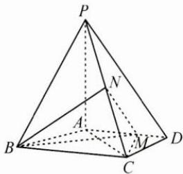

<!-- question-source:start -->
2. 如图, 在四棱锥 $P - ABCD$ 中, $PA \perp$ 平面 $ABCD$ , $AD \parallel BC$ , $AB = AD = AC = 3$ , $PA = BC = 4$ , $M$ 为线段 $AD$ 上一点, $AM = 2MD$ , $N$ 为 $PC$ 的中点.

(1) 证明: $MN \parallel$ 平面 $PAB$ ;

(2) 求四面体 N-BCM 的体积.
<!-- question-source:end -->

![[Q00009943A1]]
