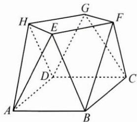

<!-- question-source:start -->
3. 小明同学设计了一个封闭的包装盒, 如图所示, 底面 ABCD 是边长为 8 (单位: cm) 的正方形, $\triangle EAB$ , $\triangle FBC$ , $\triangle GCD$ , $\triangle HDA$ 均为正三角形, 且它们所在的平面都与平面 ABCD 垂直.

(1) 证明: $EF \parallel$ 平面 $ABCD$ ;

(2)求该包装盒的容积.(不计包装盒材料的厚度)
<!-- question-source:end -->

![[Q00009944A1]]
