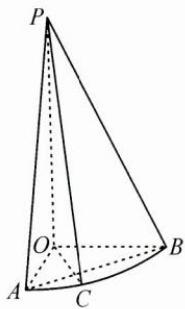

<!-- question-source:start -->
4. 如图，在 Rt△POA 中， $PO \perp OA, PO = 2OA = 4$ ，将△POA 绕边 PO 旋转到△POB 的位置，使 $\angle AOB = 90^{\circ}$ ，得到圆锥的一部分，C 为 $\widehat{AB}$ 上的点，且 $\widehat{AC} = \frac{1}{3}\widehat{AB}$ .

(1) 求点 O 到平面 PAB 的距离；

(2)设直线 PC 与平面 PAB 所成的角为 $\varphi$ ，求 $\sin\varphi$ 的值.
<!-- question-source:end -->

![[Q00009945A1]]
