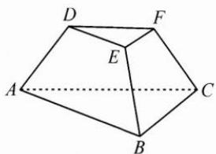
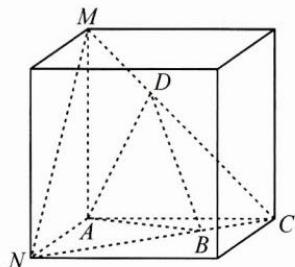

## (三)局部迁移,重设背景

例 3 如图, 在三棱台 DEF-ABC 中, 平面 ADFC⊥平面 ABC, $\angle ACB = \angle ACD = 45^{\circ}$ , 求 DF 与平面 DBC 所成角的正弦值.

思路 将问题中的 A, B, C, D 四点提取出来, 保持其相对位置不变, 整体植入正方体中, 可得 DF 是正方体的棱 AC 的平行线, 平面 DBC 是正方体的截面.

解答 如图, 将棱台放入以 AC 为棱的正方体内, 则点 B, D 均在正方体面对角线所在的直线上, 则 DF 与平面 DCB 所成角即为 AC 与平面 CMN 所成角, 计算得所求线面角的正弦值为 $\frac{\sqrt{3}}{3}$ .

反思 立体几何问题的本质,就是研究空间几何体中点、线、面三者之间的位置关系,而几何体中的面由线段围成,线段又由点相连得到,因此,对于立体几何问题的研究,归根到底就是对空间中点的定位.本题考查了在错综复杂的几何系统中提取关键元素的能力,在保持问题中相关点、线、面相对位置不变的情况下整体提取图形,并植入正方体中,实现化繁为简.

