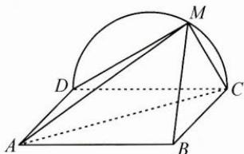
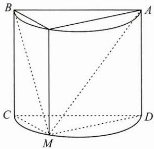
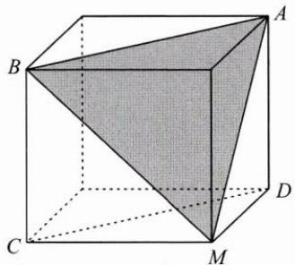
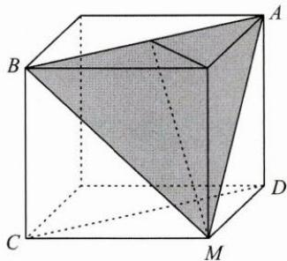

## (二)翻转模型,底面重构

例 2 如图, 正方形 ABCD 所在平面与半圆弧 CD 所在平面垂直, M 是半圆弧 CD 上异于 C, D 的点. 当三棱锥 M-ABC 的体积最大时, 求平面 MAB 与平面 MCD 所成二面角的正弦值.

思路 以平面 MCD 为底面, 将四棱锥 M-ABCD 补形为三棱柱, 并进一步补形为长方体, 则平面 MAB 为长方体的截面, 平面 MCD 为长方体的底面.

解答 由题意可知, 当 MC=MD 时, 三棱锥 M-ABC 的体积最大.

如图,以等腰 Rt△MCD 为底面,将四棱锥 M-ABCD 补形为底面是等腰直角三角形的直棱柱(图 1),并进一步补形为长方体(图 2),则平面 MAB 为长方体的截面,平面 MCD 为长方体的底面.取 AB 的中点 F,连接 EF,MF,如图 3,∠EFM 即为所求二面角的平面角.

设 $MC = MD = a$ ，则 $CD = AD = EM = \sqrt{2} a, EF = \frac{\sqrt{2}}{2} a, \tan \angle EFM = \frac{EM}{EF} = 2,$ $\sin \angle EFM = \frac{2}{5}\sqrt{5}$ ，即平面 $MAB$ 与平面 $MCD$ 所成二面角的正弦值为 $\frac{2}{5}\sqrt{5}$ .

图1

图2

图3

反思 本题考查从不同视角观察几何模型的能力. 当问题涉及的面斜置时, 尝试翻动几何体, 使其中一个相关面成为底面, 将问题中的线面角、面面角模型转化成几何定义中的标准模型, 从而降低解题的难度.
