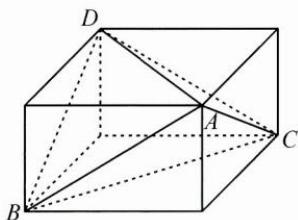

## (一) 追本溯源, 还原立方

例 1 在四面体 A-BCD 中, 三组对棱的长分别相等且依次为 $\sqrt{41}$ , $\sqrt{34}$ , 5, 则此四面体的体积为 \_\_\_\_.

思路 四面体 A-BCD 的三组对棱长分别相等, 可将其补形为三个面的对角线长分别为 $\sqrt{41}$ , $\sqrt{34}$ , 5 的长方体.

解答 如图, 将四面体 ABCD 补形为面对角线长分别为 $\sqrt{41}$ , $\sqrt{34}$ , 5 的长方体, 可求得长方体的长、宽、高分别为 5, 4, 3, 则长方体的体积为 60, 四面体的体积为长方体的 $\frac{1}{3}$ , 即四面体的体积为 20.

反思 本题考查了整体看问题的能力, 当问题提供的几何体模型为非特殊多面体时, 可依据其几何特征, 尝试补形. 如遇台体, 可将其补形为锥体; 如遇锥体, 可将其补形为直棱柱, 甚至长方体.
