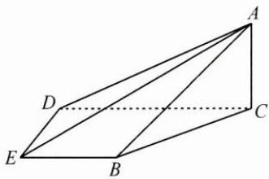

<!-- question-source:start -->
1. 如图，在四棱锥 A-BCDE 中，平面 $ABC \perp$ 平面 BCDE, $\angle CDE = \angle BED = 90^{\circ}$ , AB = CD = 2, DE = BE = 1, $AC = \sqrt{2}$ ，求二面角 B-AD-E 的大小.

<!-- question-source:end -->

![[Q00009947A1]]
