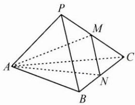

<!-- question-source:start -->
2. 如图, 三棱锥 $P - ABC$ 的底面是边长为 3 的等边三角形, 侧棱 $PA = 3$ , $PB = 4$ , $PC = 5$ , 设 $M, N$ 分别是 $PC, BC$ 的中点, 求直线 $AP$ 与平面 $AMN$ 所成角.

<!-- question-source:end -->

![[Q00009948A1]]
