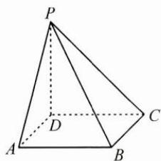

<!-- question-source:start -->
3. 如图, 四棱锥 $P - ABCD$ 的底面为正方形, $PD \perp$ 底面 $ABCD$ . 设平面 $PAD$ 与平面 $PBC$ 的交线为 $l$ . 若 $PD = AD, Q$ 为 $l$ 上的点, 求 $PB$ 与平面 $QCD$ 所成角的正弦值的最大值.

<!-- question-source:end -->

![[Q00009949A1]]
