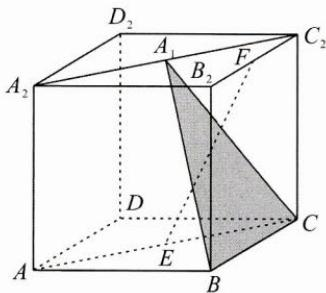
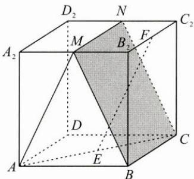

> [!faq]- 巩固练习答案
> **【答案】** 详见解析
>
> **【解析】**
> 本题中的几何体是一个底面为直角三角形的斜三棱柱，侧面 $A_{1}ACC_{1}$ 为菱形，且垂直于底面，问题是求直线 $EF$ 与平面 $A_{1}BC$ 所成角的余弦值，因此，需要探寻 $E, F, A_{1}, B, C$ 这五个点的位置关系。既然如此，直接将这五个点迁移到长方体中，重新构建几何体。如图1，作长方体 $ABCD - A_{2}B_{2}C_{2}D_{2}$ ，其中 $AB = AA_{2} = \sqrt{3}a, BC = a$ ，则由题意可得 $A_{1}$ 为 $A_{2}C_{2}$ 的中点，又 $A_{1}F \parallel \frac{1}{2} AB$ ，所以 $F$ 为 $B_{2}C_{2}$ 的中点。
> 
> 图1
> 取 $A_{2}B_{2}$ 的中点 $M, C_{2}D_{2}$ 的中点 $N$ ，如图2，则平面 $A_{1}BC$ 即为平面 $BCNM$ ，又因为 $AM \parallel EF$ ，所以 $\angle AMB$ 即为所求线面角。在正方形 $ABB_{2}A_{2}$ 中，可得 $\cos \angle AMB = \frac{3}{5}$ 。
> 
> 图2
