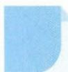

## 71 辅助平面法

引路人 浙江省鄞州中学 杨洁

本思想方法涉及模块:立体几何.

![[高中/思维方法/高中数学思想方法导引2023版/71_辅助平面法/方法介绍/方法介绍.md]]
![[高中/思维方法/高中数学思想方法导引2023版/71_辅助平面法/二典例示范/二典例示范.md]]
![[高中/思维方法/高中数学思想方法导引2023版/71_辅助平面法/巩固练习/巩固练习.md]]
